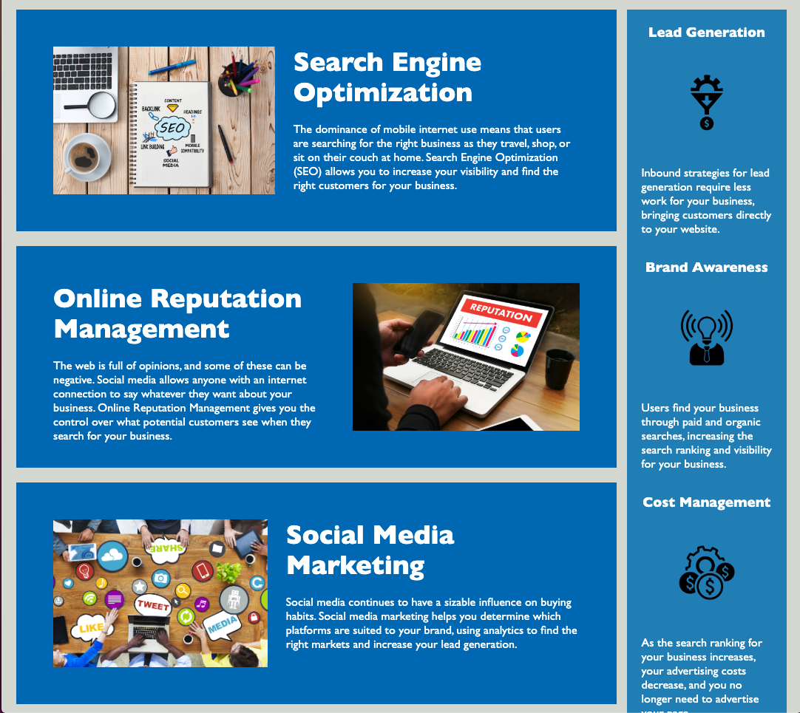

# 01 HTML CSS Git: Code Refactor

This project's purpose was to refactor a webpage so that the application links function properly, selectors / properties are consolidated and organized to follow semantic structure, and the code is optimized for search engines, like Google.

## User Story

```
AS A marketing agency
I WANT a codebase that follows accessibility standards
SO THAT our own site is optimized for search engines
```

## Acceptance Criteria

```
GIVEN a webpage meets accessibility standards
WHEN I view the source code
THEN I find semantic HTML elements
WHEN I view the structure of the HTML elements
THEN I find that the elements follow a logical structure independent of styling and positioning
WHEN I view the image elements
THEN I find accessible alt attributes
WHEN I view the heading attributes
THEN they fall in sequential order
WHEN I view the title element
THEN I find a concise, descriptive title
```

## Screenshots
This application is intended for test purposes.<br>
Please view deployed GitHub [HERE](https://pfaffster.github.io/Challenge-1-Code-Refactor/)




## Built With

* HTML
* CSS


#### LINKS:

---

## [Github_Repository](https://github.com/Pfaffster/Challenge-1-Code-Refactor "Challenge 1: Code Refactor")

---

## [Website](https://pfaffster.github.io/Challenge-1-Code-Refactor/ "Horiseon")

- - -
© 2019 Trilogy Education Services, a 2U, Inc. brand. All Rights Reserved.